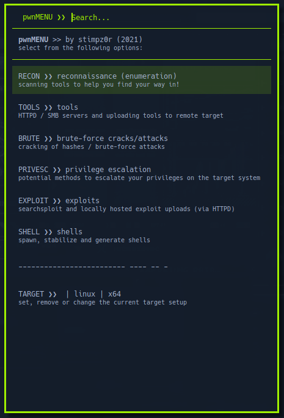

# pwnMENU
## by stimpz0r (2022)

A [rofi](https://github.com/davatorium/rofi) menu created for pentesters to help streamline and automate the tasks required to pentest a target.

> **NOTE:** This script is purely intended for use on targets that you have authority to perform a penetration test on (whether it be commercially or for friend/family), for CTFs or testing on your own system. I am not responsible for any misuse of this menu or the tools that it uses / operates.

This script is based on [dmenu_pentest](https://github.com/Cipher7/dmenu_pentest) by Cipher007, and has been heavily modified from the original. Credit goes to Cipher007 for the original idea! The **rofi** theme was originally by [adi1090x](https://github.com/adi1090x) from his polybar-themes repo (the ["hack"](https://github.com/adi1090x/polybar-themes#hack) theme) updated for use on pwnMENU by yours truly... with a theme based on the [HackTheBox VSCode theme](https://marketplace.visualstudio.com/items?itemName=silofy.hackthebox) colours.

This script will NOT run the tools directly for you (except for the *HTTP*/*SMB* servers, `searchsploit` and certain commands for `msfvenom` to build the menus depending on what you select), but will allow you to build the necessary command line syntax to run the tools required - the commands are copied directly to your clipboard for you to paste anywhere you choose.

The only other caveat to the above rule is the **stabilize shell** feature - to use this you must first select the window with the shell you wish to stabilize before running **pwnMENU**, as it will output commands to that window to automate the stabilization of the shell (including grabbing the correct terminal dimensions for `stty`)

Here is a screenshot of the main menu:

### Features

- Added the **"SHELLS"** menu
	- Get the command to start a *netcat* listener based on the target port settings
	- Spawn shells using various methods dependant on the target OS
	- Spawn *TTY shell* via *Python* to semi-stabilize the shell (if full stabilization is not possible)
	- Stabilizing shells will grab the correct tty dimensions from stty and sets them, will also disable bash history and is *ZSH* compatible!
	- *MSFVenom* section has been completely rewritten to simplify and extend even further
- Added the **"PRIVESC"** menu determined by target OS / arch - e.g. select a **Linux** target and get **Linux** privesc tools!
	- Outputs a command that will download the privesc file from the *Python* *HTTPD* server controlled by **pwnMENU** (and execute)
	- Added support for *linPEAS*, *Linux Smart Enumeration*, *LinEnum* & *suid3num* for **Linux** targets
	- Added support for *winPEAS*, *Seatbelt*, *PowerView*, *PowerUp*, *Invoke-Kerberoast*, *LaZagne* & *Mimikatz* for **Windows** targets
	- Added a **"DOWNLOAD"** menu that allows you to set the remote download method on the target (also dependant on target OS)
- Added the **"RECON"** menu to help enumerate targets by building command line syntax for enumeration applications
	- Added support for *NMAP*, *FeroxBuster*, *Nikto*, *CMSeeK*, *WPScan* & *SQLMap*
- Added the **"TOOLS"** menu
	- Added the ability to start and stop both a *HTTPD* and *SMBD* server using *Python* (*SMBD* server requires **Impacket** `smbserver.py`) to help upload tools to the target, or even exfiltrate data from the target (using *SMBD*).
	- Added the **"UPLOAD"** menu to allow downloading handy tools hosted on the *HTTPD* to the target via platform-specific methods
- Added the **"EXPLOIT"** menu
	- Added a front-end to *searchsploit*, that lets you search (in-menu) for exploits, locally mirror the exploit (as a clipboard command), or even run an *NMAP xml scan* through searchsploit to check for exploitable services (requires nmap to be used with `-oX` output and `-sV`)
	- Added an **"UPLOAD"** menu to allow downloading exploits hosted on the *HTTPD* to the target via platform-specific methods.
- **pwnMENU** can detect if you have an *IP* address in your clipboard and will allow you to select it as a target *IP* address or as your attack IP (connectback address).
	- It will also keep 3 *IP*s and ports in history, grab the *IP*s of all non-local network interface and even grab up your public IP for using as your attack *IP*/*port*.
	- You can also set a "default" IP & port to use as your attack machine details, which can also simply point to a network interface that **pwnMENU** will automatically look up and set accordingly
	- **pwnMENU** will allow you to set your target details in the menu that are exported to a temporary file (named `target.cfg`) that will automatically use those details each time **pwnMENU** is started, so you do not need to set it each time.

### Requirements

- **pwnMENU** requires the following installed on the attack box:
	- [rofi](https://github.com/davatorium/rofi)
	- `xclip` for copying commands to your clipboard
	- `xte` for stabilizing shells (used to send commands to the shell window)
	- [Impacket](https://github.com/SecureAuthCorp/impacket) for SMBD server via `smbserver.py`
	- Python 3 for HTTPD server
		- You will also need a directory to store the relevant tools for the HTTPD on your attack box - use my [pwnTOOLS](https://github.com/stimpz0r/pwnTOOLS) repo for the correct layout required by **pwnMENU**
		- To use the "PRIVESC" menu features you need to ensure that the following tools are stored in your HTTPD folder:
			- *linPEAS*, *Linux Smart Enumeration*, *LinEnum*, *suid3num*, *winPEAS*, *Seatbelt*, *PowerView*, *PowerUp*, *Invoke-Kerberoast*, *LaZagne* & *Mimikatz*
	- You also need to install any of the following, stored somewhere in your path so **pwnMENU** will allow you to generate commands:
		- *NMAP*
		- *FeroxBuster*
		- *Nikto*
		- *CMSeeK*
		- *WPScan*
		- *SQLMap*
		- *MSFVenom*
		- *searchsploit*

### Installation

Once you have installed all the requirements, to install **pwnMENU**simply clone the repo to your home directory (or wherever you wish), and edit `pwn_menu.sh` - change any of the settings dependant on your setup / requirements and save the file. 

To launch **pwnMENU**, i strongly suggest adding a keyboard shortcut via your window manager. Bind it to a key that is not being used and is easy to reach (I personally use `ctrl-x`).

**pwnMENU** has been tested on both a [BlackArch]([https://blackarch.org/](https://blackarch.org/)) and [Parrot OS](https://parrotsec.org) setup, but it should work fine with [Kali](https://kali.org) as well.

### To-do in the future...

[-] Add support for *CrackMapExec*, *gobuster*, and any other tools that can help with recon / enumeration
[-] Complete the **"BRUTE"** menu, including adding *John*, *Hashcat* and *Hydra* support
[-] Add support for *Active Directory* related tools (such as *Impacket*, *Rubeus*, and other tools / methods for enumerating and exploiting AD) 
[-] ... ? 

Feel free to suggest any features you wish to be implemented in pwnMENU via the Issues tab, and I will do my best to implement them when time permits.

